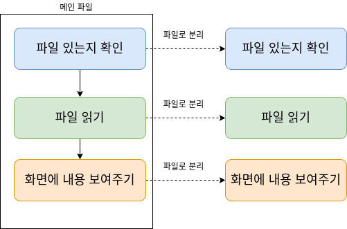

## 기능을 각각의 파일로 분리하기
- 파일을 읽을 때 필요한 코드를 기능별로 각각의 파일에 나누어 넣을 수 있다.
- 
## 모듈 : 별도의 파일로 분리된 독립 기능을 모듈이라고 한다.
- 모듈을 만들어 놓으면 다른 파일에서 모듈을 불러와 사용할 수 있다.
- exports 전역 개체를 사용 한다

- module1.js
<pre><code>
exports.함수이름 = 함수정의
</code></pre>
- main.js
<pre><code>
const module1 = require('module1')
module1.함수이름()
</code></pre>
## exports와 module.exports의 사용
- 모듈 파일 안에서 exports를 사용할 수도 있고 modeule.exports를 사용 할 수도 있다.
- 객체를 직접 할당하려면 module.exports를 사용 한다.
- module1.js
<pre><code>
exports.plus = function(a, b){
  return a + b
}
exports.multiply = function(a, b){
  return a * b
}
</code></pre>
- module2.js
<pre><code>
const calc = {}
calc.plus = function(a, b){
  return a + b
}
calc.multiply = function(a, b){
  return a * b
}
module.exports = calc
</code></pre>
## 더하기 함수를 모듈로 분리하기
- 모듈 분리 전에 더하기 함수 사용 코드
<pre><code>
const calc = {}
calc.plus = function(a, b){
  return a + b
}
console.log('모듈로 분리하기전 - calc.plus 함수 호출 결과 : ' + calc.add(10, 10))
</code></pre>
- 모듈 파일 생성 : calc.js
- 함수를 exports 객체의 add 속성으로 추가
<pre><code>
exports.plus = function(a, b){
  return a + b
}
</code></pre>
- 모듈 파일을 불러들인 후 plus함수 호출
- require 함수를 이용해 모듈 파일을 불러들임
- 불러들인 결과 객체는 exports 객체로 간주 할 수 있다.
- 파일이 아닌 폴더를 지정하면 그 폴더 안에 들어있는 index.js 파일을 불러 들인
<pre><code>
const calc = require('./calc')
console.log('모듈로 분리한 후 - calc.plus 함수 호출 결과 : ' + calc.plus(10, 10))
</code></pre>
## 모듈 파일에서 module.exports 사용
- 모듈 파일 생성 : calc2.js
- calc 객체를 만들고 그 객체 그대로 module.exports에 할당
<pre><code>
const calc = {}
calc.plus = function(a, b){
  return a + b
}
module.exports = calc
</code></pre>
## 메일 파일
- 모듈 파일을 불러들인 후 plus 함수 호출
- require 함수를 이용해 모듈 파일을 불러들임
- 불러들인 결과 객체는 moduele.exports 객체로 간주 할 수 있다.
```
const calc2 = require('./calc2')
console.log('모듈로 불리한 후 - calc2.plus함수 호출 결과 : ' + calc2.plus(10, 10))
```