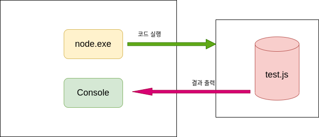

## MarkDown : 텍스트 기반의 마크업언어, Html로 변환이 가능하다.
### Headers : 문서제목 ( # 1~ 6 )
<pre>
# This is a H1
## This is a H2
### This is a H3
#### This is a H4
##### This is a H5
###### This is a H6
</pre>
# This is a H1
## This is a H2
### This is a H3
#### This is a H4
##### This is a H5
###### This is a H6
## BlockQuote : 이메일에서 사용하는 > 블럭인용문자 사용
<pre>
> This is a first blockquote.
>   > This is a second blockquote.
>   >   > This is a third blockquote.
</pre>
> This is a first blockquote.
>   > This is a second blockquote.
>   > > This is a third blockquote.
## 순서있는 목록(번호) : 숫자와 점을 사용한다.
<pre>
1. first
2. second
3. third
</pre>
1. first
2. second
3. third
## 현재까지는 어떤 번호를 입력해도 순서는 내림차순으로 정렬된다. (해결되지 않은 문제점)
<pre>
1. first
3. third
2. second
</pre>
1. first
3. third
2. second
## 순서없는 목록 ( 글머리 기호 : *, +, - 지원 )
<pre>
* Red
  * Green
    * Blue
+ Red
  + Green
    + Blue
- Red
  - Green
    - Blue
</pre>
* Red
  * Green
    * Blue
+ Red
  + Green
    + Blue
- Red
  - Green
    - Blue
## 들여쓰기 : 4개의 공백 또는 하나의 탭으로 들여쓰기를 만나면 변환되기 시작하여 들여쓰지 않은 행을 만날때까지 변화이 계속된다. 
> 한줄 띄어쓰지 않으면 인식이 제대로 안되는 문제점 발생
<pre>
This is a normal paragraph:

    This is a code block.
end code block.
</pre>
This is a normal paragraph:

    This is a code block.
end code block.
## 코드블럭 : ```<pre><code>{code}</code></pre>```와 ``` 사용
- ```<pre><code>{code}</code></pre>```
## 수평선 : ```<hr/>```
```
***
---
<hr/>
```
***
---
<hr/>

## 링크
- 외부링크 : <http:/google.co.kr>
- 이메일링크 : <address@example.com>
# 강조 : 문장 중간에 사용할 경우는 띄어 쓰기를 사용 한다.
```
- *single asterisks*
- **double asterisks**
- ~~cancel line~~
```
- *single asterisks*
- **double asterisks**
- ~~cancel line~~

## 이미지 
```


```


## 줄바꿈 : 3칸 이상 띄어쓰기를 하면 줄이 바뀐다.